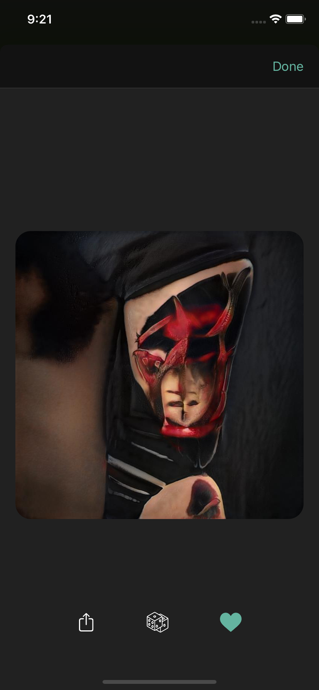

# TattooAI
iOS application for tattoo-generating Neural Network. Based on [Firebase Storage](https://firebase.google.com/docs/storage) and [TattooStyleGAN2](https://github.com/Ajasra/TattooStyleGAN2)

# UI Elements
There are two main elements of the App: [Generator](#Generator) and [Collection](#Collection). They are contained inside TabBarController

## Generator
User can set preffered parameter for image generating
Image Generator | Generator Parameters
:---: | :---:
 | 

## Collection

Generated Collection | Detail View (with Sharing option)
:---: | :---:
 | 
